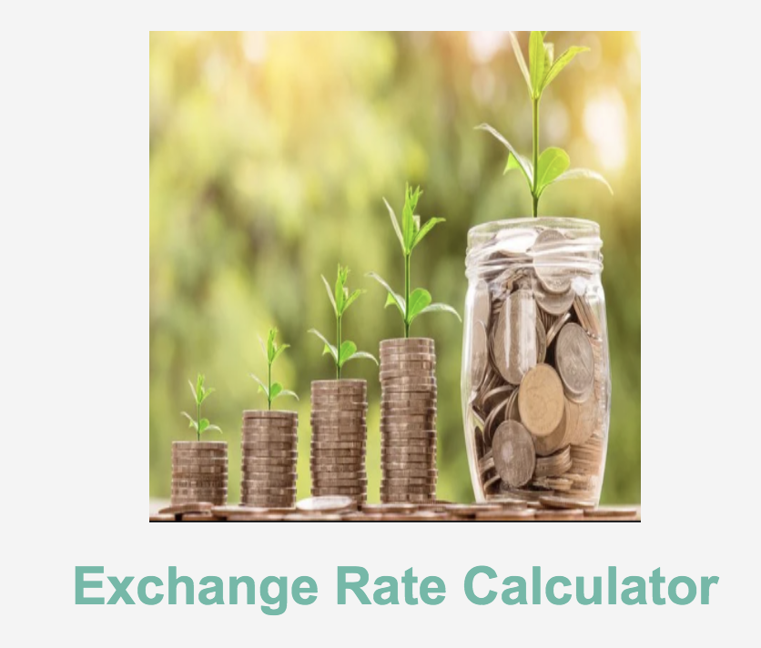
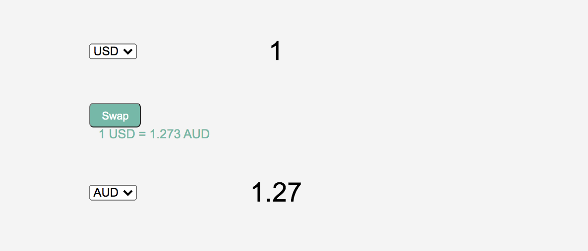

# exchange-rate-calculator-

## Name: 
Exchange Rate Calculator 

## Description:
An Exchange Rate calculator that uses ExchangeRate API and Fetch API. Users are able to convert currencies and swap them. The API that I used is called exchangerate-api and it provides about 1500 click for their free version. 

## Visuals and Video 

[(https://youtu.be/dsemwX2TFvQ)]

## Live Projects on Netlify Link:

https://exchange-rate-calculator2021.netlify.app/

## Usage

This is a sample of the project. 

